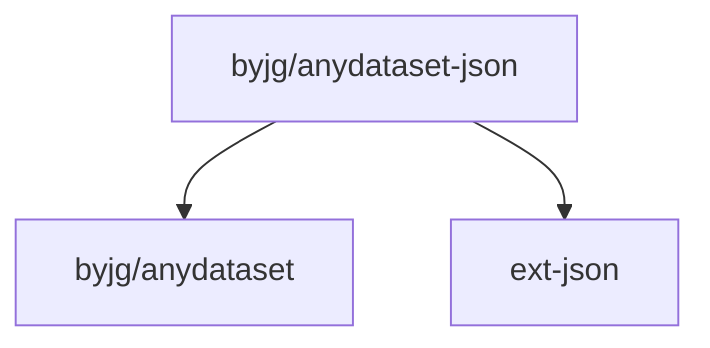

# AnyDataset-Json

[](https://github.com/byjg/php-anydataset-json/actions/workflows/phpunit.yml)
[](http://opensource.byjg.com)
[](https://github.com/byjg/php-anydataset-json/)
[](https://opensource.byjg.com/opensource/licensing.html)
[](https://github.com/byjg/php-anydataset-json/releases/)

JSON abstraction dataset. Anydataset is an agnostic data source abstraction layer in PHP. 

See more about Anydataset [here](https://opensource.byjg.com/anydataset).

## Examples

### Simple Manipulation

example1.json
```json
[
   {
      "name":"Joao",
      "surname":"Magalhaes",
      "age":"38"
   },
   {
      "name":"John",
      "surname":"Doe",
      "age":"20"
   },
   {
      "name":"Jane",
      "surname":"Smith",
      "age":"18"
   }
]
```
example1.php
```php
<?php
$json = file_get_contents('example1.json');

$dataset = new \ByJG\AnyDataset\Json\JsonDataset($json);

$iterator = $dataset->getIterator();
foreach ($iterator as $row) {
    echo $row->get('name');       // Print Joao, John, Jane
    echo $row->get('surname');    // Print Magalhaes, Doe, Smith
    echo $row->get('age');        // Print 38, 20, 18
}
```

### Specific Path

example2.json
```json
{
   "menu":{
      "header":"SVG Viewer",
      "items":[
         {
            "id":"Open"
         },
         {
            "id":"OpenNew",
            "label":"Open New"
         }
      ]
   }
}
```

example2.php
```php
<?php
$json = file_get_contents('example2.json');

$dataset = new \ByJG\AnyDataset\Json\JsonDataset($json);

$iterator = $dataset->getIterator("/menu/items");
foreach ($iterator as $row) {
    echo $row->get('id');       // Print "Open", "OpenNew"
    echo $row->get('label');    // Print "", "Open New"
}
```

### Extracting Fields

example3.json
```json
{
   "menu":{
      "header":"SVG Viewer",
      "items":[
         {
            "id":"Open",
            "metadata":{
               "version":"1",
               "date":"NA"
            }
         },
         {
            "id":"OpenNew",
            "label":"Open New",
            "metadata":{
               "version":"2",
               "date":"2021-10-01"
            }
         }
      ]
   }
}
```

example3.php
```php
$json = file_get_contents('example3.json');

$dataset = new \ByJG\AnyDataset\Json\JsonDataset($json);

$iterator = $dataset->getIterator("/menu/items")
                        ->withFields([
                            "name" => "id",
                            "version" => "metadata/version"
                        ]);
foreach ($iterator as $row) {
    echo $row->get('name');       // Print "Open", "OpenNew"
    echo $row->get('version');    // Print "1", "2"
}
```

### Extract fields with wild mask

example4.json
```json
{
   "menu":{
      "header":"SVG Viewer",
      "items":[
         {
            "id":"Open",
            "metadata":[
               {
                  "version":"1",
                  "date":"NA"
               },
               {
                  "version":"beta",
                  "date":"soon"
               }
            ]
         },
         {
            "id":"OpenNew",
            "label":"Open New",
            "metadata":[
               {
                  "version":"2",
                  "date":"2021-10-01"
               }
            ]
         }
      ]
   }
}
```

example4.php
```php
$json = file_get_contents('example4.json');

$dataset = new \ByJG\AnyDataset\Json\JsonDataset($json);

$iterator = $dataset->getIterator("/menu/items")
                        ->withFields([
                            "name" => "id", 
                            "version" => "metadata/*/version"
                        ]);
foreach ($iterator as $row) {
    echo $row->get('name');       // Print "Open", "OpenNew"
    echo $row->get('version');    // Print ["1", "Beta"], ["2"]
}
```

## Install

```
composer require "byjg/anydataset-json"
```

## Running the Unit tests

```bash
vendor/bin/phpunit
```

## Dependencies



----
[Open source ByJG](http://opensource.byjg.com)
